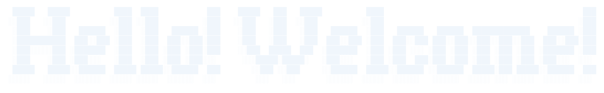

  <picture>
    <source media="(prefers-color-scheme: dark)" srcset="assets/banner_darkmode.png">
    <source media="(prefers-color-scheme: light)" srcset="assets/banner_lightmode.png">
    
  </picture>

---

  <picture>
    <source media="(prefers-color-scheme: dark)" srcset="assets/text_darkmode.svg">
    <source media="(prefers-color-scheme: light)" srcset="assets/text_lightmode.svg">
    
  </picture>

---

  <strong>
    <a href="https://wchun055.github.io/">My Website</a>
  </strong>

  Visit my <strong><a href="https://ringobingo.itch.io/">Itch</a></strong> page if you are interested as well!

  <picture>
    <source media="(prefers-color-scheme: dark)" srcset="assets/animals_darkmode.gif">
    <source media="(prefers-color-scheme: light)" srcset="assets/animals_lightmode.gif">
    
  </picture>

